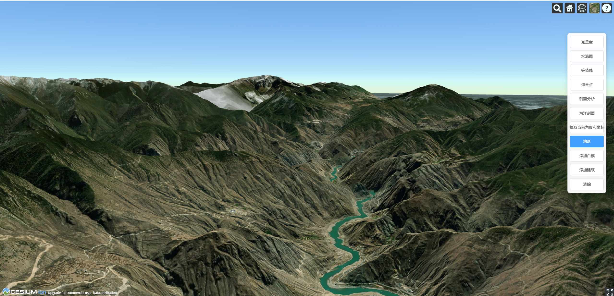
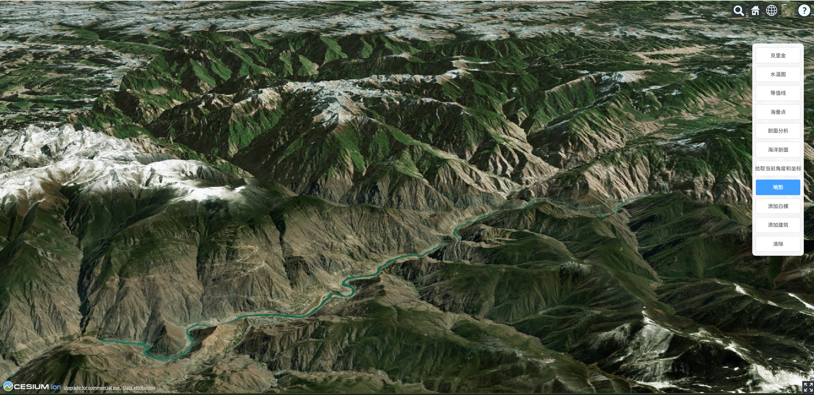
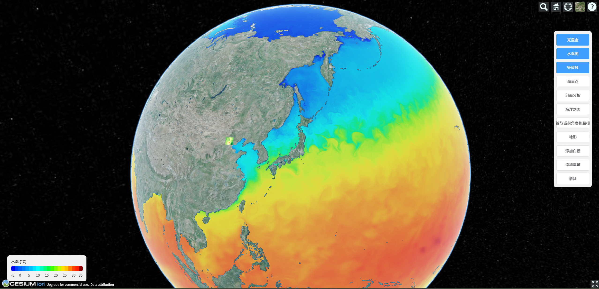
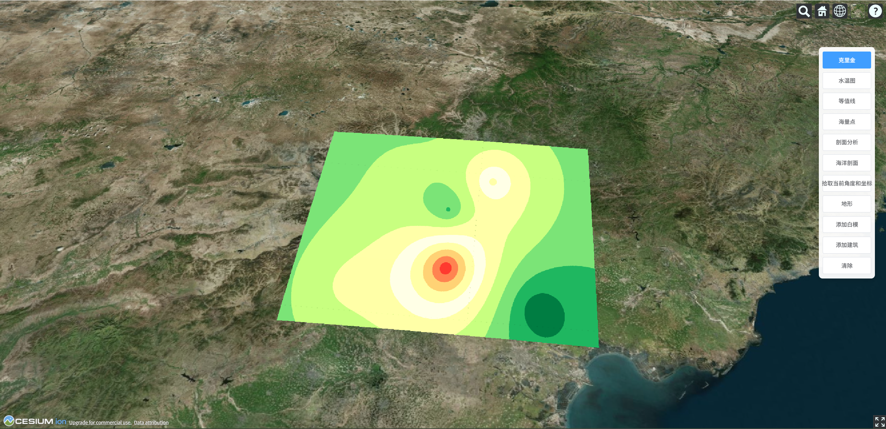
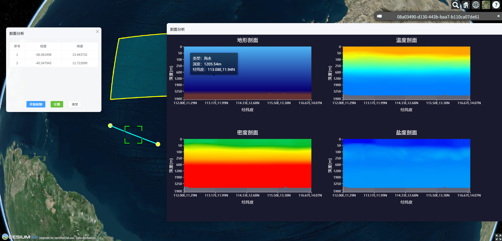
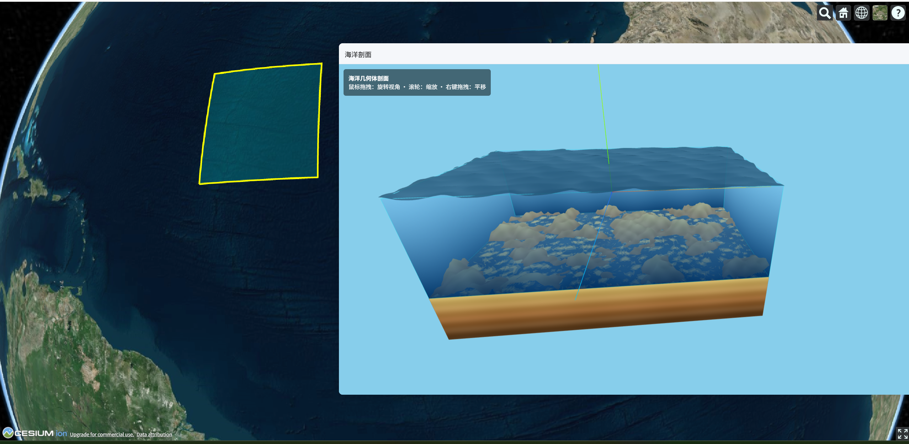
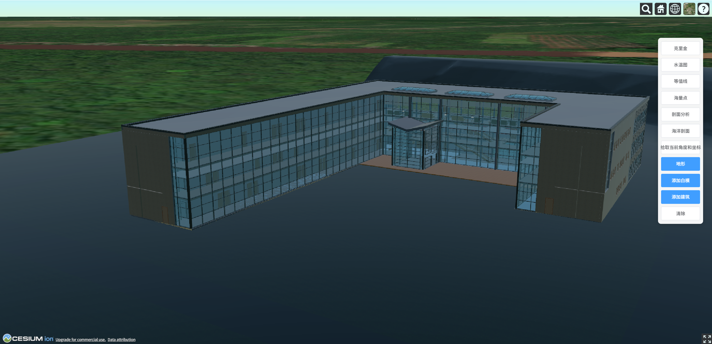
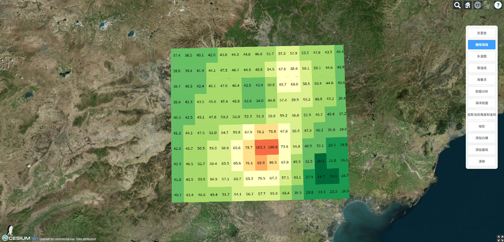

# Vue3 + TypeScript + Vite + Pinia + Cesium

## 项目描述

基于 **Vue 3**、**TypeScript**、**Vite**、**Pinia** 和 **Cesium** 的三维地图应用。Cesium 的初始化与 Viewer 由 Pinia 统一管理，任意组件均可通过 store 调用地图能力。

**主要功能：**

- **克里金插值**：在指定范围内根据离散点进行克里金插值并在地图上展示色带面，支持绘制后飞到此区域，清除时可一并移除。
- **剖面分析**：支持在地图上绘制剖面线（左键加点、线跟随鼠标、右键结束），在可移动面板中查看点列表（序号、经度、纬度），并可加载剖面数据生成 ECharts 剖面图（地形/温度/密度/盐度等）。
- **工具栏**：右侧固定工具栏，提供克里金、渐变图、等值线、栅格图、剖面分析、清除等操作入口。
- **可移动面板**：通过 `MoveBox` 组件实现可拖拽、可关闭的浮层，用于剖面分析、剖面图表等界面。

适用于需要三维地图、空间插值与剖面分析的前端场景。

## 功能展示

### 三维地形

基于 Cesium 的全球三维地球与地形展示，支持缩放、旋转与地形渲染。


  
 

### 全球水温图

全球范围水温栅格数据展示，支持色带与图例。



### 克里金插值

在划定区域内根据离散采样点进行克里金插值，生成连续色带面并支持飞到此区域。



### 剖面分析

在地图上绘制剖面线，在可移动面板中查看剖面点列表与 ECharts 剖面图（地形/温度/密度/盐度等）。



### 海洋剖面

海洋剖面数据在三维场景中的展示效果。



### 添加建筑

在三维地图上添加建筑模型的展示效果。



### 栅格填值

基于克里金插值结果，在等间距经纬格网上反算权重值，以彩色底图 + 黑色文字标注在栅格中心显示，并渲染到三维地图。支持按视角高度分档切换格网密度与字号，视角越高格网越疏、文字越少，视角越低格网越密、文字越多。



### 二维 OpenLayers

独立路由页面（/map2d）使用 OpenLayers 加载二维底图（ArcGIS Online 世界街道图），左上角仅保留「返回三维地图」链接，无放大缩小等默认控件，便于国内访问。


## 技术栈

- **Vue 3** + **TypeScript**
- **Vite** 构建
- **Pinia** 状态管理
- **Cesium** 三维地图
- **Element Plus** UI 与图标
- **ECharts** + **echarts-gl** + **echarts-stat** 剖面图表

## 安装与运行

```bash
npm install
npm run dev
```

构建：

```bash
npm run build
npm run preview
```

## Cesium 与 Pinia

- **Store**：`src/stores/cesium.ts`
  - **Viewer**：`viewer`、`isReady`、`init(container, options?)`、`destroy()`、`getViewer()`
  - **绘制线**：`startDrawLine()`、`endDrawLine()`、`clearDrawLine()`、`drawLinePoints`
  - **克里金**：`drawKriging()`（绘制并 flyTo）、`clearKriging()`
  - **剖面分析**：`openTerrainProfile()`、`closeTerrainProfile()`、`showTerrainProfile`
  - **剖面图表**：`openSectionChart(data)`、`closeSectionChart()`、`showSectionChart`、`sectionChartData`

- **地图容器**：`src/components/CesiumMap.vue` 在挂载时调用 `init`，卸载时调用 `destroy`。

## 在组件中使用 Cesium

```ts
import { useCesiumStore } from '@/stores/cesium'
import * as Cesium from 'cesium'

const cesiumStore = useCesiumStore()

// 确保已就绪后使用
if (cesiumStore.isReady && cesiumStore.viewer) {
  cesiumStore.viewer.camera.flyTo({
    destination: Cesium.Cartesian3.fromDegrees(116.4, 39.9, 100000),
    duration: 2,
  })
}

// 或使用 getViewer()（未初始化会抛错）
const viewer = cesiumStore.getViewer()
viewer.entities.add({ ... })
```

示例组件见 `src/components/ExampleUsage.vue`（可选，演示飞到北京等操作）。

## 项目结构

```
src/
  main.ts              # 入口，引入 Cesium 样式、Pinia、挂载 App
  App.vue              # 根组件，挂载 CesiumMap、Toolbar、剖面/图表面板
  stores/
    cesium.ts          # Cesium Pinia store（Viewer、绘制线、克里金、剖面状态等）
  components/
    CesiumMap.vue      # 地图容器，负责 init/destroy
    MoveBox/           # 可移动、可关闭的浮层组件
    pages/
      Toolbar.vue      # 右侧工具栏（克里金、剖面分析、清除等）
      TerrainProfile/  # 剖面分析：面板、表格、剖面图（ECharts）
      ExampleUsage.vue # 使用 store 的示例（可选）
  assets/data/
    krigingSample.ts   # 克里金示例数据
  utils/Kring/
    kriging.js         # 克里金插值算法（train / grid / plot）
  style.css
  env.d.ts
```

## 说明

- 使用 `vite-plugin-cesium` 处理 Cesium 静态资源和构建。
- Cesium 的 Widgets 样式在 `main.ts` 中通过 `import 'cesium/Build/Cesium/Widgets/widgets.css'` 引入。
